I'm a robotics engineer with 10+ years of experience across software, mechanical, and electrical engineering. In particular I'm experienced with perception, visual SLAM, planning, and multi-agent systems, and with C++, Python, ROS, and Docker.

<!--
# Skills/interests

<table style="border:0">
  <tr style="vertical-align:top;border:0">
    <td style="width:50%;border:0">
      <ul>
        <li>C++</li>
        <li>Python</li>
        <li>ROS</li>
        <li>Git</li>
        <li>Docker</li>
      </ul>
    </td>
    <td style="width:50%;border:0">
      <ul>
        <li>Computer vision</li>
        <li>SLAM</li>
        <li>Path planning</li>
        <li>Task planning and execution</li>
        <li>Multi-agent systems</li>
      </ul>
    </td>
  </tr>
</table>

 
-->

<!-- Conigital -->

<h2 style="line-height: 1.75em; margin-top: 0em; margin-bottom: 0.3em">Conigital Australia 
Senior Engineer</h2>

<em>10/2021 to present</em>

I'm currently a senior engineer at Conigital, a company developing autonomous vehicles for research institutions and government projects.
Initially I mainly worked on perception, managing the perception stack and (in collaboration with a machine learning engineer) integrating machine learning models for image/point cloud object detection, classification and tracking, image/point cloud segmentation, position estimation and tracking.
I also wrote ROS nodes for image processing with OpenCV, point cloud processing (e.g. merging and undistorting) with PCL, and video streaming with gstreamer.

Later, I took responsibility for more of the overall system, refactoring the vehicle software to improve ease of use and collaboration, which involved reorganising ROS packages and Git repositories, and writing Docker containers, ROS launch files, and scripts for building and running the software.

<figure style="width: 80%; margin: auto; margin-top: 1.5em; margin-bottom: 2em">
  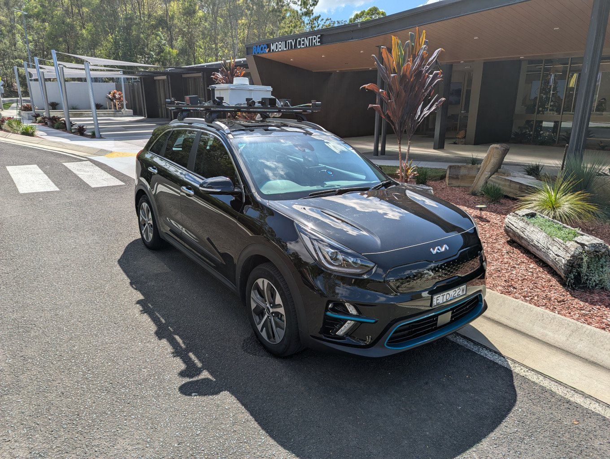
  <figcaption style="text-align: center; font-size: 0.9em">A Conigital vehicle with sensing hardware</figcaption>
</figure>

Most recently I've worked more generally on the vehicles, including:

- Selecting sensors and computing and networking hardware
- Designing and building equipment and sensor mounts, and various other parts
- Writing ROS drivers for the cameras, LiDAR sensors, radars, INS, and Drive-by-Wire module
- Setting up time synchronisation by distributing a GPS PPS signal and configuring GPSd and PTPd
- Configuring basic localisation (wheel odometry, IMU, GNSS) using robot_localization
- Writing documentation

<figure style="width: 80%; margin: auto; margin-top: 1.5em; margin-bottom: 2em">
  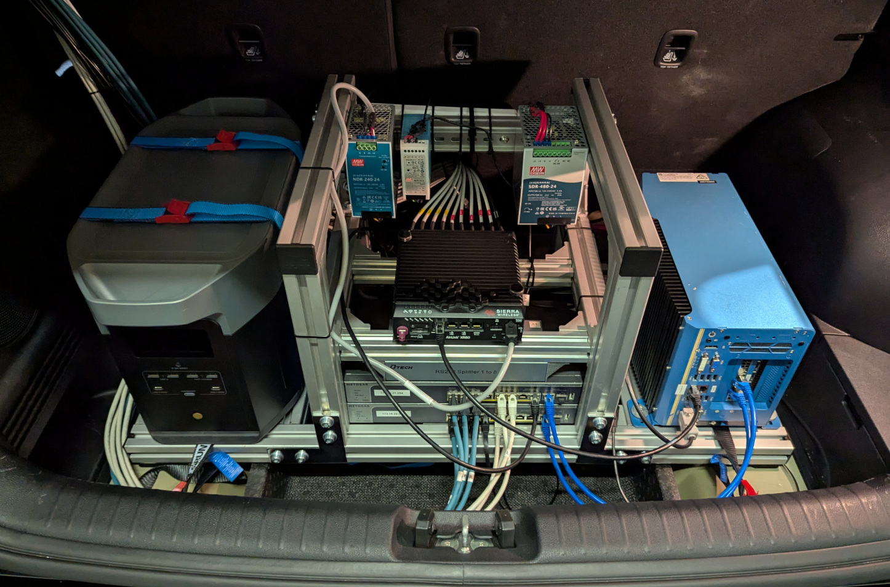
  <figcaption style="text-align: center; font-size: 0.9em">Processing hardware in the rear of the vehicle</figcaption>
</figure>

<!-- ACFR -->

<h2 style="line-height: 1.75em; margin-top: 0em; margin-bottom: 0.3em">Australian Centre for Field Robotics (University of Sydney) 
Technical Officer</h2>

<em>06/2020 to 10/2021</em>

At ACFR I was a technical officer in the marine group, mainly working as a software engineer on a project to develop low cost seafloor imaging vehicles ("floats").
The floats are only able to control depth and drift in the ocean.
Given knowledge of the ocean currents, the floats are deployed at a location to image a path along the seafloor.

<figure style="width: 40%; margin: auto; margin-top: 1.5em; margin-bottom: 2em">
  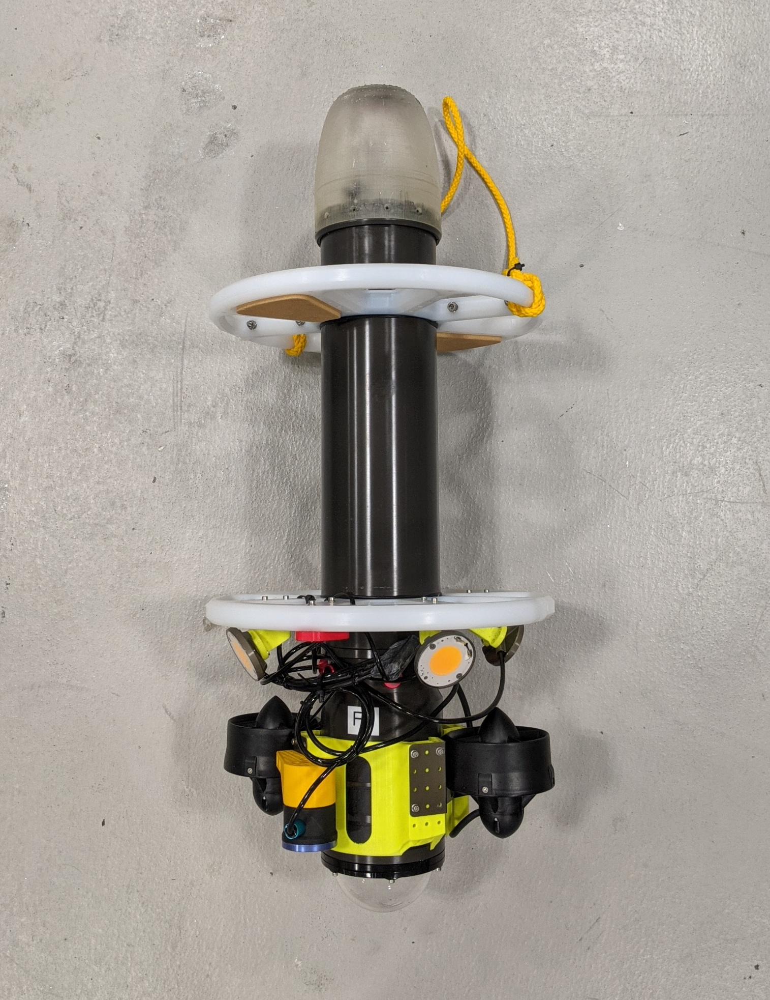
  <figcaption style="text-align: center; font-size: 0.9em">A seafloor image float</figcaption>
</figure>

The project included deploying and recovering the floats from manned or autonomous surface vessels (ASVs), and managing the system from a support ship.
Float missions were created using seafloor habitat maps and information on ocean currents, which were translated into float deployment/recovery tasks for the surface vessels.

I designed the architecture of the system, which involved multiple agents and multiple computers/microcontrollers within the agents.
I wrote most of the software (in C++ with ROS), with the main exceptions being float mission planning and the software for the main computer in the floats.
ROS messages, services, and actions were used for communication (with fkie_multimaster allowing for communication between ROS masters), and protobuf messages over LoRa for longer range communication.

<figure style="width:90%; margin: auto; margin-top: 1.5em; margin-bottom: 2em">
  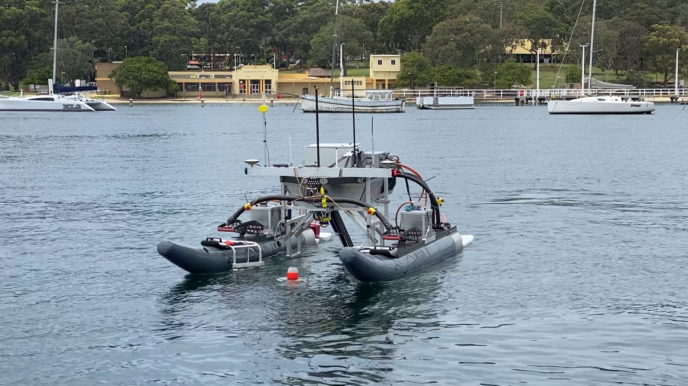
  <figcaption style="text-align: center; font-size: 0.9em">The WAM-V autonomous surface vessel (ASV) in the process of recovering a float</figcaption>
</figure>

Some of the more significant components of the system I wrote were:

- A system manager and a cooperative multi-agent A* path planner, which took the float mission plan and created float deployment/recovery tasks for the surface vessels
- An ASV task manager built on behaviour trees (using [BehaviorTree.CPP](https://www.behaviortree.dev/)) to autonomously deploy and recover floats
- A workboat task manager and user interface, to guide the workboat crew on deploying and recovering floats
- Dummy replacements of many of the ROS nodes, to allow for testing of the system or components
- Extensive ROS launch files for flexible execution of the system or components, as well as Docker containers for portability

<figure style="width:80%; margin: auto; margin-top: 1.5em; margin-bottom: 2em">
  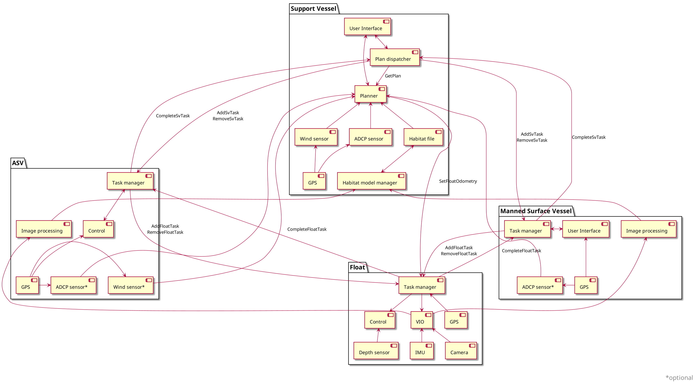
  <figcaption style="text-align: center; font-size: 0.9em">An early component diagram for the float project</figcaption>
</figure>

For the ASV (a WAM-V), my work included:

- Writing camera, ADCP, and DVL drivers
- Configuring localisation with robot_localization
- Designing and assembling the electronics for the launch and recovery system (LRS)
- Programming the microcontrollers in the LRS (as well as in the floats), using the Arduino framework in PlatformIO with rosserial
- Mentoring a student in developing an algorithm to detect floats from monocular images, and to control the WAM-V to capture the float

<figure style="width: 80%; margin: auto; margin-top: 1.5em; margin-bottom: 2em">
  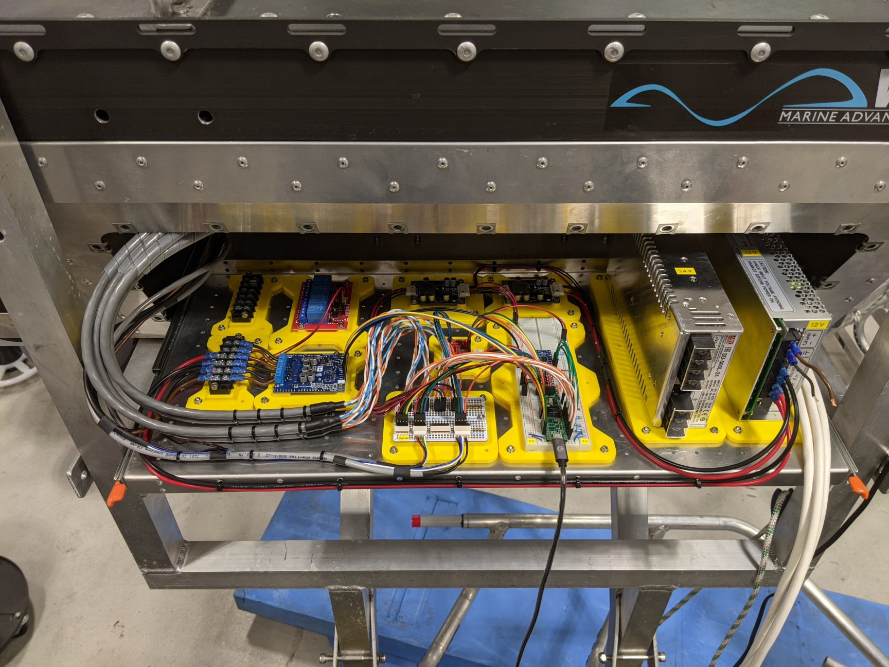
  <figcaption style="text-align: center; font-size: 0.9em">The electronics bay of the WAM-V launch and recovery system (LRS)</figcaption>
</figure>

<!-- CAS -->

<h2 style="line-height: 1.75em; margin-top: 0em; margin-bottom: 0.3em">Centre for Autonomous Systems (University of Technology Sydney)</h2>

<em>07/2014 to 06/2020</em>

At UTS I completed a research Master of Engineering and a coursework Master of Engineering, and was also employed as a teaching assistant and research assistant at the Centre for Autonomous Systems.

<figure style="width: 60%; margin: auto; margin-top: 1.5em; margin-bottom: 2em">
  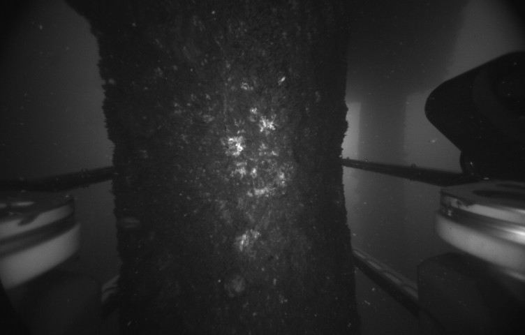
  <figcaption style="text-align: center; font-size: 0.9em">An image of a submerged bridge pile taken by the ROV</figcaption>
</figure>

The topic of my research Master of Engineering (01/2017 to 01/2019) was [Accurate 3D Reconstruction of Underwater Infrastructure using Stereo Vision](https://opus.lib.uts.edu.au/handle/10453/135990).
My research was part of an industry project to develop an underwater Remotely Operated Vehicle (ROV) to clean and inspect submerged bridge piles.
I was responsible for perception, evaluating image processing, stereo correspondence, and point cloud processing algorithms for the challenging underwater environment.
I looked at stereo visual SLAM, evaluating feature extraction, description and matching algorithms in MATLAB and C++.
I also modified ORB-SLAM2 to improve ROS integration, and wrote a library for bundle adjustment using different parameterisations in C++ with Ceres Solver.

<figure style="margin-top: 1.5em; margin-bottom: 2em">
  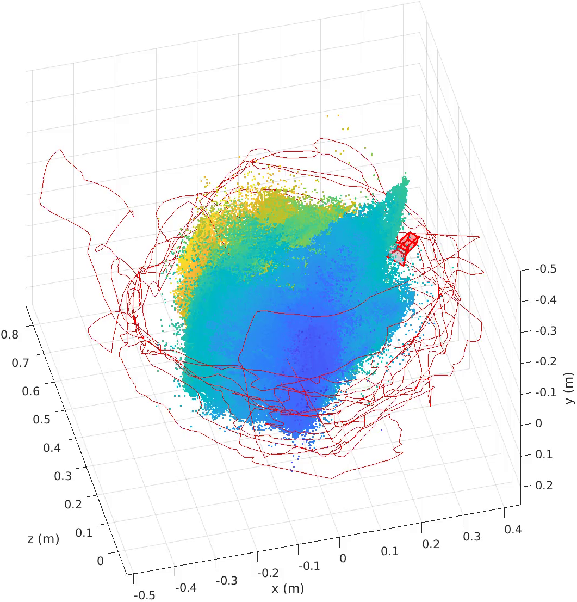
  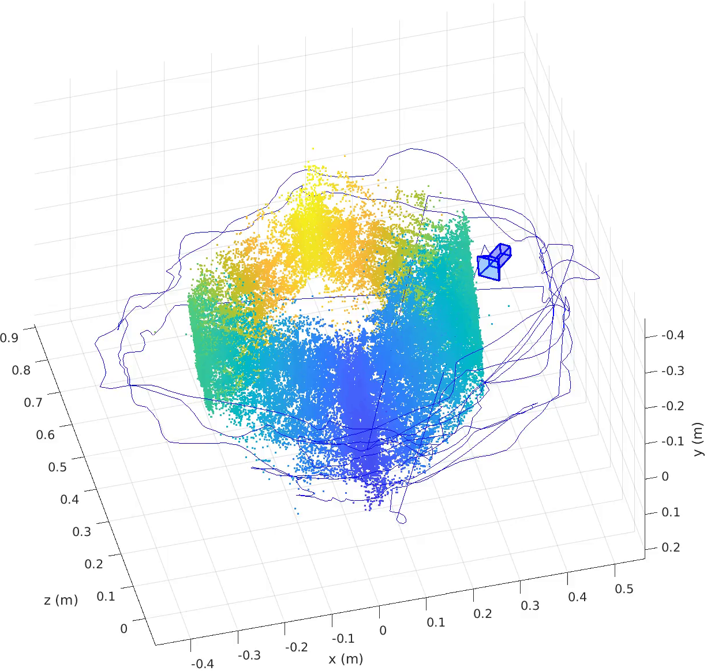
  <figcaption style="text-align: center; font-size: 0.9em">Results from visual SLAM before (left) and after (right) post processing with parallax bundle adjustment</figcaption>
</figure>

<figure style="width: 35%; margin: auto; margin-top: 1.5em; margin-bottom: 2em">
  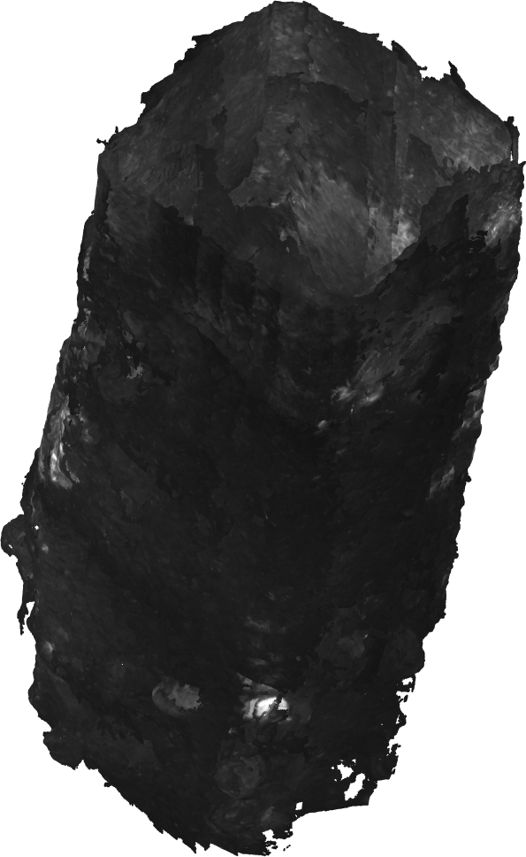
  <figcaption style="text-align: center; font-size: 0.9em">Reconstruction of a submerged bridge pile</figcaption>
</figure>

As a research assistant (01/2019 to 06/2020) I worked on various projects involving perception, mapping, and planning, including:

- A beef carcass scanner, where I set up 6 RealSense D435 cameras with synchronised triggering, wrote a Structure from Motion system in MATLAB for testing, and also a visual SLAM system for ROS in C++ using OpenCV and Ceres Solver.
- A drink delivery robot project, where I integrated a RealSense D435 into a PAL Robotics TIAGo Base and configured move_base for robust navigation and obstacle avoidance, wrote a pure pursuit controller for docking to an AR marker, and wrote a state machine (in Python with Smach) for robust and continuous operation of the robot in an office environment.
- A project involving localisation experiments with a Fetch robot, where I used Cartographer, AMCL, and DeepLCD (a library for loop closure which uses a convolutional autoencoder deep neural network) to evaluate improving LiDAR based localisation with sub maps.

<figure style="width: 100%; margin: auto; margin-top: 1.5em; margin-bottom: 2em">
  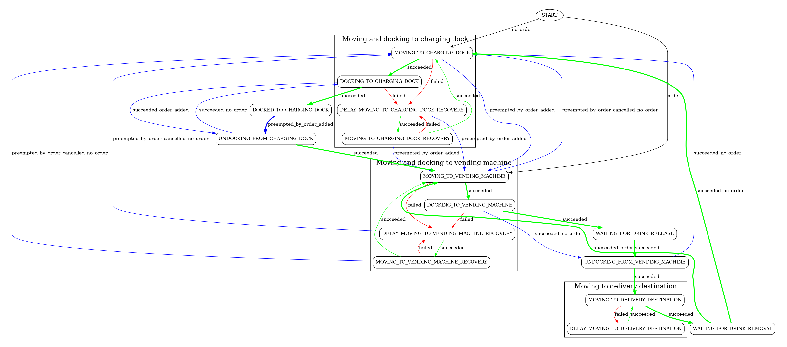
  <figcaption style="text-align: center; font-size: 0.9em">The main state machine of the drink delivery robot</figcaption>
</figure>

I worked as a teaching assistant (03/2017 to 06/2020) for the subjects [Advanced Robotics](https://handbookpre2025.uts.edu.au/2017/subjects/details/49274.html), [Design Optimisation for Manufacturing](https://handbookpre2025.uts.edu.au/2017/subjects/details/49928.html), and [Robotics Studio 2](https://handbookpre2025.uts.edu.au/2020_1/subjects/details/42044.html). For these subjects I developed assignments and projects, and ran tutorial classes of up to about 40 students.

I completed a coursework Master of Engineering (07/2014 to 11/2015) with a GPA of 3.85/4.0. For the major project I looked at cooperative path planning algorithms for a warehouse Automated Guided Vehicle system, and created a simplified simulation in MATLAB to test algorithms including constrained A*, hierarchical cooperative A*, and joint state space A*.

<!-- Earlier -->

<h2 style="line-height: 1.75em; margin-top: 0em; margin-bottom: 0.3em">Earlier</h2>

I worked as an intern in hardware development at tado (07/2013 to 01/2014), a smart home thermostat company. I redesigned power supply circuitry to improve efficiency and communication circuitry to improve compatibility with various bus systems. Around the same time I also worked casually as a hardware designer for a small electronic design company, where I wrote VHDL code for an FPGA to process video input and output signals to drive a custom RGB LED display, and also some embedded programming in C for an MSP430.

Towards the end of (and after) completing a Bachelor of Engineering (03/2007 to 11/2011) at UTS I worked as a Mechatronic Engineer at Control Devices (01/2011 to 12/2012), a distributor of industrial sensors and controls. I designed and manufactured metal (machined) and plastic (3D printed) parts, and assembled, tested, and repaired various products.
